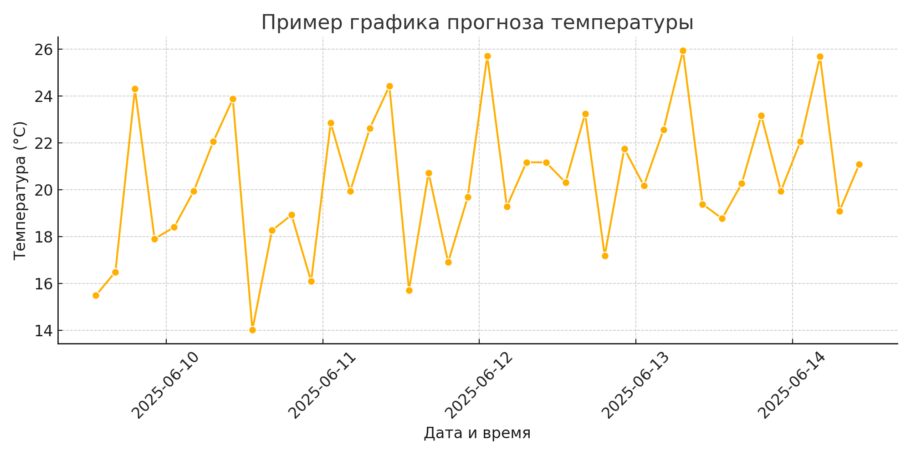

# 🌦️ Weather Tracker (Colab)

Python/Colab проект для отслеживания и визуализации погоды с использованием OpenWeatherMap API.

## 📌 Описание

Это учебный проект, созданный в рамках практики по Data Science. Приложение собирает текущие погодные данные и 5-дневный прогноз, визуализирует температуру с помощью Seaborn и сохраняет данные в CSV.
---

## 🚀 Возможности

- 🔍 Получение текущей температуры и описания погоды
- 📈 Построение графика изменения температуры
- 🗓️ Прогноз на 5 дней (почасовой)
- 💾 Сохранение истории погоды в `.csv`
- ☁️ Запуск прямо в Google Colab

---

## 📂 Структура

Файл | Назначение
---|---
`weather_tracker_colab.ipynb` | основной
`README.md` | это описание проекта

---

## ⚙️ Как использовать

1. Получите API-ключ на [openweathermap.org/api](https://openweathermap.org/api)
2. Откройте [файл в Google Colab](https://colab.research.google.com/github/yourusername/weather-tracker-colab/blob/main/weather_tracker_colab.ipynb)
3. Вставьте API-ключ в переменную `API_KEY` в начале 
4. Запустите ячейки

```python
API_KEY = "ваш_ключ"
```

---

## 💾 Пример 

Файл: [`weather_forecast_example.csv`](./weather_forecast_example.csv)

---


## 📊 Пример графика



---

## 🛠️ Используемые технологии

- Python 3
- OpenWeatherMap API
- Pandas
- Seaborn
- Matplotlib
- Google Colab

---

## 

- Работа с API в Python
- Сбор и обработка данных
- Построение графиков в Seaborn
- Работа с Colab как с интерфейсом для прототипов

---

